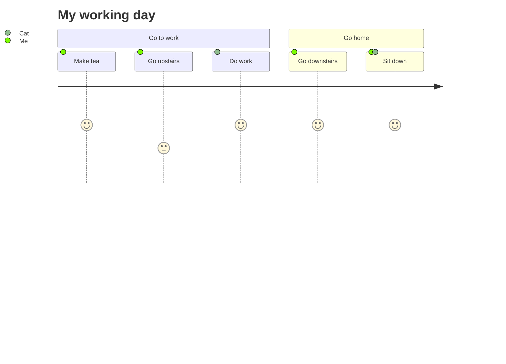
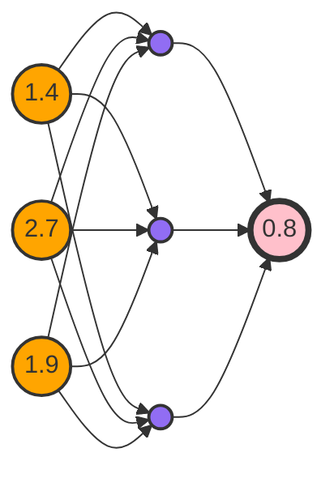

## Using HTML in Blue Topaz

```ad-info
title: More Colorful Notes by Using HTML

Here you will find more ways to make your notes more colorful by using some simple HTML lables.

Please have fun with it!😊😊😊


```


### stickies
*thanks to death_au, Gabroel and Lithou from Obsidian Members Group on Discord*

|          What you typed          | What you get in your notes |
|:--------------------------------:|:--------------------------:|
| `<p class="stickies"> The Blue Topaz!❤️  </p>` | <p class="stickies"> The Blue Topaz!❤️  </p>                           |
| `<p class="stickies2"> The Blue Topaz!❤️  </p>` |   <p class="stickies2"> The Blue Topaz!❤️  </p>                         |
| `<p class="to-recall"> The Blue Topaz!❤️  </p>`                                 | <p class="to-recall"> The Blue Topaz!❤️  </p>                           |


```ad-blank
<p class="stickies"> Whatever your put in the stick </p>
Using sticks to reminding some importent things is fun!

May some times will try it out!

```

**Rich text** are supported in *Sticks*

<p class="stickies2"> Whatever <b> you put in the stick ! </b> </p>
Using sticks to reminding some importent things is fun! It also support **HTML**!

May some times will try it out!

Hide-and-show!

<p class="to-recall"> Read one more time I will remember it! </p>
This back things I always foget. This back things I always foget. This back things I always foget. This back things I always foget. This back things I always foget. This back things I always foget. This back things I always foget. This back things I always foget. This back things I always foget. This back things I always foget. This back things I always foget. This back things I always foget. This back things I always foget.

### aside
_thanks to dcoales from obsidian member group on discord\
<https://discord.com/channels/686053708261228577/702656734631821413/794236352857374764>_

|             What you typed             |           What you will get            |
|:--------------------------------------:|:--------------------------------------:|
| `<aside><h1> Your words </h1></aside>` | <aside> <h1> Your words </h1> </aside> |
| `<aside><h2> Your words </h2></aside>` | <aside><h2> Your words </h2></aside>                                       |
```ad-warning
title: "Your Word" only shows in ** `Reading and Source Mode` ** mode, it will be NOT show up in `Live Preview` mode.


```


<aside> <h1> This words only shows in Reading and Source mode </h1> </aside> blah blah blah blah blah blah blah blah blah blah blah blah blah blah blah blah blah blah blah blah blah blah blah blah blah blah blah blah blah blah blah blah blah blah blah blah blah blah blah blah blah blah blah blah blah blah blah blah 


blah blah blah blah blah blah blah blah blah blah blah blah blah blah blah blah blah blah blah blah blah blah blah blah 
<aside> <h2> Live Preview mode this words despaired! </h2> </aside> blah blah blah blah blah blah blah blah blah blah blah blah blah blah blah blah blah blah blah blah blah blah blah blah blah blah blah blah blah blah blah blah blah blah blah blah blah blah blah blah blah blah blah blah blah blah blah 
blah blah blah blah blah blah blah blah blah blah blah blah blah blah blah blah blah blah blah blah blah blah blah blah blah blah blah blah blah blah blah blah blah blah blah blah blah blah blah blah blah blah blah blah blah blah blah 


## Checklists
- [<] Less than, from
	- [+] add
- [>] Great than, go
- [!] ideas
- [?] questions
- [x] checked
- [ ] hollow
- [-] removed

---
```ad-example
title: Example of Checklists

1. [ ] aaa
		1. [x] as
		2. [!] aa
		3. [+] aaa
2. [>] aa
		1. [<] from here
3. [?] I have a question
4. [-] removed

```


## Mermaid
**Mermaid** now can adapt width accordingly.


``````ad-example
title: Example: Mermaid 1
`````
Below is your words,
------------------

`````
With above words, your got this drawing! 

``````


``````ad-example
title: Example: Mermaid 2
`````
Your typed words below.
-----------------------

`````
With above words, your got this drawing! 


``````


## YAML cssclass 
### Image Adopt Width, with `cssclass: img-grid`
![[Pictures in Notes#Method Three]]

### Code Block Auto-Wrap,  with `cssclass: code-wrap`
```yaml
---
cssclass: code-wrap
---
```

Example: [[code-wrap【代码块自动换行】 EN| Click Here]]

### Inline list, with `cssclass: inline-list`

It can also be used together with inline images.

```yaml
---
cssclass: inline-list
---
```

Example: [[inline-list| Click Here]]

### Pseudo-kanban
Make unordered lists (includes checkbox) looks like a kanban style. 

Two methods of Pseudo-Kanban
- First, ![[Yaml declaration]] 

```yaml
---
cssclass: kanban
---
```

Examples: [[Pseudo Kanban CSS declairation | Click Here]]

- Secondary, Using `Admonition` plugin's  ad-kanban

Example of Pseudo Kanban: [[Pseudo Kanben, ad and callout declaration EN | Click Here]]

Example of Normal Kanban:[[Kanban|Kanban]]


![[Admonition Split Columns]]

### Table custom styles
Table custom styles are not built into the theme, you need to enable the `[custom]TableStyles.css`
css snippet to take effect. Reference:[[Customized Table Styles]]

 Set table without line break, you can make all the table content no longer line break display with Style settings plugin 2.3.8 Table
Style settings plugin 3.6 is optimized for Dataview tables, you can turn on the option to make the dataview table compact, i.e. try to display one row, and the first column width is fixed.

### Callout 
[[Callout Styles Show-off and Use]]
